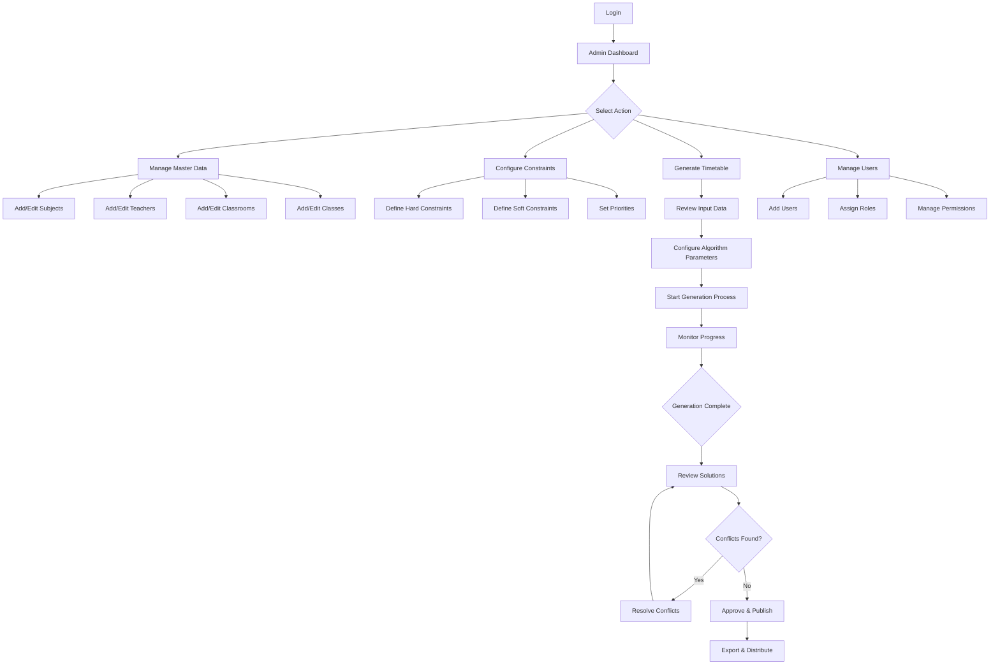
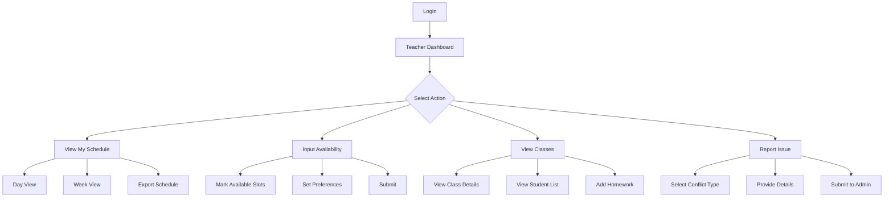
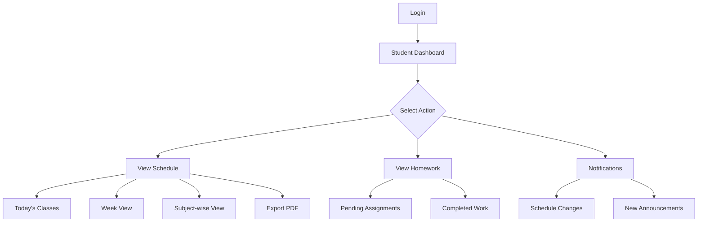
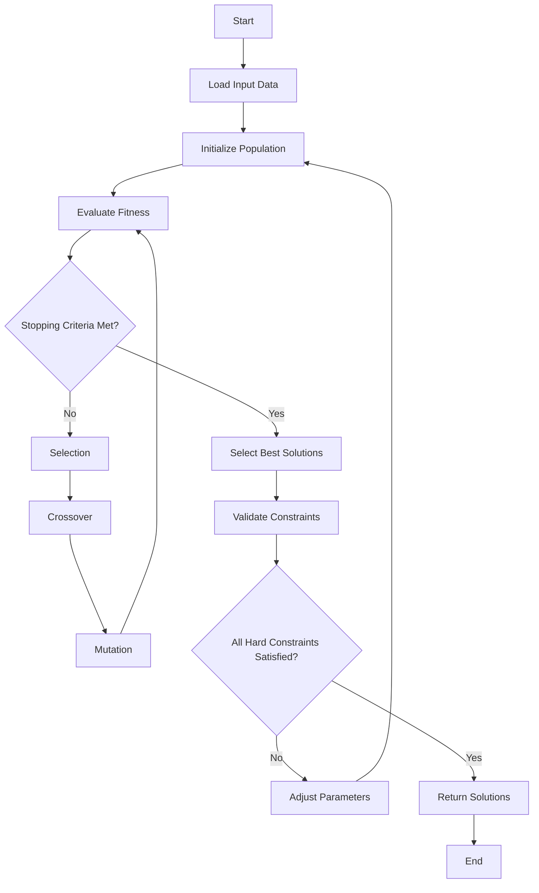

# Smart Timetable Generator - Comprehensive Development Plan

## Executive Summary

The Smart Timetable Generator is an AI-powered mobile application designed to revolutionize educational scheduling by replacing manual, error-prone timetable creation with an intelligent, automated system. Using optimization algorithms (primarily genetic algorithms), the application will generate conflict-free, efficient, and balanced schedules while respecting both hard and soft constraints.

**Primary Goals:**
- Reduce administrative time spent on timetable creation by 80%+
- Eliminate scheduling conflicts automatically
- Optimize resource utilization (teachers, classrooms, time slots)
- Provide real-time access to schedules for all stakeholders

---

## 1. Project Scope Definition

### 1.1 Problem Statement
Current manual scheduling processes in educational institutions are:
- Time-consuming (often taking weeks to complete)
- Error-prone (conflicts in teacher assignments, room bookings)
- Inflexible (difficult to accommodate last-minute changes)
- Inefficient (suboptimal resource utilization)

### 1.2 Solution Overview
An AI-powered cross-platform mobile application that:
- Automates timetable generation using genetic algorithms
- Handles complex constraints (hard and soft)
- Provides role-based access for different user types
- Enables real-time updates and collaboration
- Exports schedules in multiple formats

### 1.3 Target Users

#### Administrators (Full Control)
- Complete system configuration
- Input management (subjects, teachers, rooms, constraints)
- Timetable generation and approval
- User management
- System analytics and reporting

#### Teachers (View + Limited Input)
- View personal schedules
- Input availability and preferences
- View assigned classes and rooms
- Mark conflicts or issues
- Track homework assignments

#### Students (View Only)
- View class schedules
- Access homework and assignments
- Receive notifications for changes
- Export personal timetables

### 1.4 Out of Scope (For MVP)
- Attendance tracking
- Grade management
- Parent portal
- Fee management
- Library integration

---

## 2. Critical Features List

### 2.1 MVP Features (Phase 1 - 3-4 months)

#### 2.1.1 User Authentication & Authorization
- Secure login/signup with email verification
- Role-based access control (Admin, Teacher, Student)
- Password recovery and reset
- Session management
- Multi-factor authentication (optional for admins)

#### 2.1.2 Data Input Management
**Master Data:**
- Subject management (name, code, type, duration)
- Teacher management (name, email, subjects qualified, max hours/week)
- Classroom management (name, capacity, type, equipment)
- Class/Section management (grade, section, student count)
- Time slot configuration (periods, breaks, days)

**Constraints:**
- Hard constraints (non-negotiable):
  - No teacher in two places simultaneously
  - Room capacity must not be exceeded
  - Teacher subject qualification
  - Maximum teaching hours per teacher per day/week
  - Lab sessions require specific rooms
  
- Soft constraints (preferences):
  - Teacher time preferences
  - Minimize gaps between classes
  - Distribute difficult subjects evenly
  - Avoid consecutive lectures for the same subject
  - Teacher workload balancing

#### 2.1.3 Automated Timetable Generation
- Genetic algorithm implementation
- Configurable optimization parameters
- Progress tracking during generation
- Multiple solution generation (top 3-5 alternatives)
- Manual override capability

**Algorithm Flow:**
1. Initialize random population of timetables
2. Evaluate fitness (constraint satisfaction)
3. Selection (tournament/roulette)
4. Crossover (combine good solutions)
5. Mutation (introduce variations)
6. Iterate until optimal solution found

#### 2.1.4 Conflict Detection & Resolution
- Real-time conflict highlighting
- Automatic conflict resolution suggestions
- Manual conflict resolution interface
- Validation before final approval
- Change impact analysis

#### 2.1.5 User Interface & Visualization
**Dashboard:**
- Role-specific landing pages
- Quick stats and notifications
- Recent activities

**Timetable Views:**
- Grid view (traditional timetable layout)
- List view (chronological)
- Day view, Week view, Month view
- Teacher-wise view
- Room-wise view
- Class-wise view

**Features:**
- Color coding by subject/teacher/room
- Search and filter
- Zoom and pan
- Responsive design for tablets and phones

#### 2.1.6 Export & Sharing
- PDF export (individual and bulk)
- Excel/CSV export
- Image export
- Print-friendly formatting
- Email distribution
- QR code generation for quick access

### 2.2 Advanced Features (Phase 2 - 2-3 months)

#### 2.2.1 Calendar Integration
- Google Calendar sync
- Microsoft Outlook sync
- Apple Calendar sync
- iCal format support
- Automatic event creation

#### 2.2.2 Real-time Updates & Notifications
- Push notifications for schedule changes
- In-app notifications
- Email alerts
- SMS notifications (optional)
- Notification preferences per user

#### 2.2.3 Machine Learning Optimization
- Learn from past scheduling patterns
- Predict optimal configurations
- User feedback incorporation
- Performance improvement over time
- Historical data analysis

#### 2.2.4 Multi-campus Support
- Central dashboard for multiple campuses
- Campus-specific configurations
- Cross-campus teacher scheduling
- Unified reporting
- Data isolation per campus

#### 2.2.5 Additional Features
- Substitute teacher management
- Room booking system
- Event scheduling (exams, meetings)
- Analytics and reporting dashboard
- Audit trail for all changes
- Backup and restore functionality

---

## 3. Proposed Technology Stack

### 3.1 Frontend (Mobile Application)

#### Flutter (Recommended)
**Pros:**
- Single codebase for iOS and Android
- Native performance
- Rich widget library
- Strong community support
- Hot reload for faster development

**Key Packages:**
- `provider` / `riverpod` - State management
- `dio` - HTTP client
- `firebase_auth` - Authentication
- `sqflite` - Local database
- `pdf` - PDF generation
- `flutter_local_notifications` - Push notifications
- `table_calendar` - Calendar views
- `fl_chart` - Data visualization

**Alternative:** React Native (if JavaScript expertise is preferred)

### 3.2 Backend

#### Python + Django (Recommended)
**Pros:**
- Excellent for algorithm implementation
- Django REST Framework for APIs
- Strong scientific computing libraries
- Good ORM for database management

**Key Libraries:**
- Django REST Framework - API development
- `celery` - Async task processing (for timetable generation)
- `redis` - Caching and message broker
- `DEAP` - Genetic algorithm library
- `numpy` / `pandas` - Data processing
- `django-cors-headers` - CORS handling

**Directory Structure:**
```
backend/
├── api/
│   ├── authentication/
│   ├── timetable/
│   ├── users/
│   └── master_data/
├── algorithms/
│   ├── genetic_algorithm.py
│   ├── constraint_checker.py
│   └── fitness_evaluator.py
├── config/
├── utils/
└── manage.py
```

**Alternative:** Node.js + Express (if JavaScript full-stack is preferred)

### 3.3 Database

#### PostgreSQL (Recommended)
**Pros:**
- Robust relational database
- ACID compliance
- Complex query support
- JSON support for flexibility
- Excellent performance

**Schema Overview:**
- Users (id, email, role, profile_data)
- Teachers (id, user_id, subjects[], preferences)
- Students (id, user_id, class_id, section_id)
- Subjects (id, name, code, duration, type)
- Classrooms (id, name, capacity, type, equipment[])
- Classes (id, grade, section, student_count)
- TimeSlots (id, day, period, start_time, end_time)
- Timetables (id, name, status, created_by, constraints)
- TimetableEntries (id, timetable_id, class_id, subject_id, teacher_id, room_id, timeslot_id)
- Constraints (id, type, parameters)

**Alternative:** 
- Firebase Firestore (for faster MVP, less complex querying)
- MySQL (cost-effective alternative to PostgreSQL)

### 3.4 Authentication & Authorization

#### Firebase Authentication
**Features:**
- Email/password authentication
- Social login (Google, Apple)
- Email verification
- Password reset
- JWT token management

**Integration:**
- Frontend: Firebase SDK
- Backend: Verify Firebase tokens
- Custom claims for role-based access

### 3.5 Cloud Infrastructure

#### Primary: AWS (Amazon Web Services)
**Services:**
- EC2 - Application hosting
- RDS - PostgreSQL database
- S3 - File storage (PDFs, exports)
- CloudFront - CDN for static assets
- Lambda - Serverless functions
- SQS - Message queuing
- CloudWatch - Monitoring and logging

#### Alternative: Google Cloud Platform
**Services:**
- Cloud Run - Container hosting
- Cloud SQL - Database
- Cloud Storage - File storage
- Cloud Functions - Serverless
- Cloud Pub/Sub - Messaging

#### Budget-Friendly: Firebase + Heroku
- Firebase (Auth, Firestore, Storage)
- Heroku (Backend hosting)
- Lower cost for initial deployment

### 3.6 DevOps & Deployment

#### Version Control
- Git + GitHub
- Branch strategy: GitFlow
- Pull request reviews

#### CI/CD
- GitHub Actions or GitLab CI
- Automated testing
- Automated deployment

#### Containerization
- Docker for backend
- Docker Compose for local development
- Kubernetes for production (optional)

#### Monitoring
- Sentry - Error tracking
- Google Analytics - User analytics
- Custom dashboard for system metrics

---

## 4. High-Level User Flow

### 4.1 Administrator Flow



### 4.2 Teacher Flow



### 4.3 Student Flow



### 4.4 Timetable Generation Algorithm Flow



---

## 5. Genetic Algorithm Design

### 5.1 Representation (Chromosome)
Each timetable is represented as a 2D array:
- Rows: Class sections
- Columns: Time slots
- Cells: {teacher_id, subject_id, room_id}

### 5.2 Fitness Function

```
Fitness Score = Hard Constraint Penalty + Soft Constraint Score

Hard Constraints (Must be 0):
- Teacher conflict: -1000 per violation
- Room conflict: -1000 per violation
- Teacher qualification: -1000 per violation
- Max hours exceeded: -500 per violation

Soft Constraints (Optimization):
- Teacher preference match: +10 per match
- Minimized gaps: +5 per removed gap
- Even distribution: +8 per balanced day
- Consecutive same subject: -3 per occurrence
```

### 5.3 Genetic Operations

**Selection:** Tournament selection (size = 5)
**Crossover:** Two-point crossover (rate = 0.8)
**Mutation:** Random swap mutation (rate = 0.1)
**Population Size:** 100-200
**Generations:** 500-1000 (or until convergence)

### 5.4 Optimization Parameters

```python
GA_CONFIG = {
    'population_size': 150,
    'max_generations': 1000,
    'crossover_rate': 0.8,
    'mutation_rate': 0.1,
    'tournament_size': 5,
    'elitism_count': 5,
    'convergence_threshold': 0.01,
    'max_stagnation': 50
}
```

---

## 6. Database Schema Design

### 6.1 Core Tables

#### Users Table
```sql
CREATE TABLE users (
    id UUID PRIMARY KEY DEFAULT gen_random_uuid(),
    email VARCHAR(255) UNIQUE NOT NULL,
    password_hash VARCHAR(255),
    role VARCHAR(50) NOT NULL,
    first_name VARCHAR(100),
    last_name VARCHAR(100),
    phone VARCHAR(20),
    is_active BOOLEAN DEFAULT true,
    created_at TIMESTAMP DEFAULT CURRENT_TIMESTAMP,
    updated_at TIMESTAMP DEFAULT CURRENT_TIMESTAMP
);
```

#### Teachers Table
```sql
CREATE TABLE teachers (
    id UUID PRIMARY KEY DEFAULT gen_random_uuid(),
    user_id UUID REFERENCES users(id),
    employee_id VARCHAR(50) UNIQUE,
    department VARCHAR(100),
    max_hours_per_day INTEGER DEFAULT 6,
    max_hours_per_week INTEGER DEFAULT 30,
    qualified_subjects UUID[] NOT NULL,
    preferences JSONB,
    created_at TIMESTAMP DEFAULT CURRENT_TIMESTAMP
);
```

#### Subjects Table
```sql
CREATE TABLE subjects (
    id UUID PRIMARY KEY DEFAULT gen_random_uuid(),
    name VARCHAR(100) NOT NULL,
    code VARCHAR(20) UNIQUE NOT NULL,
    duration INTEGER DEFAULT 45,
    type VARCHAR(50),
    requires_lab BOOLEAN DEFAULT false,
    description TEXT,
    created_at TIMESTAMP DEFAULT CURRENT_TIMESTAMP
);
```

#### Classrooms Table
```sql
CREATE TABLE classrooms (
    id UUID PRIMARY KEY DEFAULT gen_random_uuid(),
    name VARCHAR(100) NOT NULL,
    building VARCHAR(100),
    floor INTEGER,
    capacity INTEGER NOT NULL,
    type VARCHAR(50),
    equipment JSONB,
    is_available BOOLEAN DEFAULT true,
    created_at TIMESTAMP DEFAULT CURRENT_TIMESTAMP
);
```

#### Timetables Table
```sql
CREATE TABLE timetables (
    id UUID PRIMARY KEY DEFAULT gen_random_uuid(),
    name VARCHAR(255) NOT NULL,
    academic_year VARCHAR(20),
    semester VARCHAR(20),
    status VARCHAR(50) DEFAULT 'draft',
    created_by UUID REFERENCES users(id),
    approved_by UUID REFERENCES users(id),
    approved_at TIMESTAMP,
    constraints JSONB,
    fitness_score FLOAT,
    created_at TIMESTAMP DEFAULT CURRENT_TIMESTAMP,
    published_at TIMESTAMP
);
```

#### TimetableEntries Table
```sql
CREATE TABLE timetable_entries (
    id UUID PRIMARY KEY DEFAULT gen_random_uuid(),
    timetable_id UUID REFERENCES timetables(id) ON DELETE CASCADE,
    class_id UUID REFERENCES classes(id),
    subject_id UUID REFERENCES subjects(id),
    teacher_id UUID REFERENCES teachers(id),
    room_id UUID REFERENCES classrooms(id),
    day_of_week INTEGER,
    period_number INTEGER,
    start_time TIME,
    end_time TIME,
    created_at TIMESTAMP DEFAULT CURRENT_TIMESTAMP,
    UNIQUE(timetable_id, class_id, day_of_week, period_number)
);
```

### 6.2 Indexes for Performance

```sql
CREATE INDEX idx_timetable_entries_teacher ON timetable_entries(teacher_id, day_of_week, period_number);
CREATE INDEX idx_timetable_entries_room ON timetable_entries(room_id, day_of_week, period_number);
CREATE INDEX idx_timetable_entries_class ON timetable_entries(class_id, timetable_id);
CREATE INDEX idx_users_role ON users(role);
CREATE INDEX idx_timetables_status ON timetables(status);
```

---

## 7. API Design

### 7.1 Authentication Endpoints

```
POST   /api/v1/auth/register          - User registration
POST   /api/v1/auth/login             - User login
POST   /api/v1/auth/logout            - User logout
POST   /api/v1/auth/refresh           - Refresh access token
POST   /api/v1/auth/forgot-password   - Request password reset
POST   /api/v1/auth/reset-password    - Reset password
GET    /api/v1/auth/verify-email      - Verify email
```

### 7.2 User Management Endpoints

```
GET    /api/v1/users                  - List users (admin)
POST   /api/v1/users                  - Create user (admin)
GET    /api/v1/users/:id              - Get user details
PUT    /api/v1/users/:id              - Update user
DELETE /api/v1/users/:id              - Delete user (admin)
GET    /api/v1/users/me               - Get current user profile
```

### 7.3 Master Data Endpoints

```
# Subjects
GET    /api/v1/subjects               - List all subjects
POST   /api/v1/subjects               - Create subject
GET    /api/v1/subjects/:id           - Get subject
PUT    /api/v1/subjects/:id           - Update subject
DELETE /api/v1/subjects/:id           - Delete subject

# Teachers
GET    /api/v1/teachers               - List all teachers
POST   /api/v1/teachers               - Create teacher
GET    /api/v1/teachers/:id           - Get teacher
PUT    /api/v1/teachers/:id           - Update teacher
DELETE /api/v1/teachers/:id           - Delete teacher

# Classrooms
GET    /api/v1/classrooms             - List all classrooms
POST   /api/v1/classrooms             - Create classroom
GET    /api/v1/classrooms/:id         - Get classroom
PUT    /api/v1/classrooms/:id         - Update classroom
DELETE /api/v1/classrooms/:id         - Delete classroom

# Classes
GET    /api/v1/classes                - List all classes
POST   /api/v1/classes                - Create class
GET    /api/v1/classes/:id            - Get class
PUT    /api/v1/classes/:id            - Update class
DELETE /api/v1/classes/:id            - Delete class
```

### 7.4 Timetable Endpoints

```
GET    /api/v1/timetables             - List all timetables
POST   /api/v1/timetables             - Create timetable
GET    /api/v1/timetables/:id         - Get timetable
PUT    /api/v1/timetables/:id         - Update timetable
DELETE /api/v1/timetables/:id         - Delete timetable

POST   /api/v1/timetables/:id/generate    - Generate timetable
GET    /api/v1/timetables/:id/status      - Get generation status
POST   /api/v1/timetables/:id/approve     - Approve timetable
POST   /api/v1/timetables/:id/publish     - Publish timetable

GET    /api/v1/timetables/:id/conflicts   - Get conflicts
POST   /api/v1/timetables/:id/resolve     - Resolve conflict

GET    /api/v1/timetables/:id/export/pdf  - Export as PDF
GET    /api/v1/timetables/:id/export/xlsx - Export as Excel
```

### 7.5 Schedule Views

```
GET    /api/v1/schedules/teacher/:id      - Teacher's schedule
GET    /api/v1/schedules/student/:id      - Student's schedule
GET    /api/v1/schedules/class/:id        - Class schedule
GET    /api/v1/schedules/room/:id         - Room schedule
```

---

## 8. Security Considerations

### 8.1 Authentication & Authorization
- JWT-based authentication
- Role-based access control (RBAC)
- Token expiration and refresh mechanism
- Multi-factor authentication for admins
- Password complexity requirements
- Account lockout after failed attempts

### 8.2 Data Protection
- HTTPS/TLS encryption for all communications
- Database encryption at rest
- Sensitive data hashing (passwords with bcrypt)
- GDPR compliance for user data
- Regular security audits

### 8.3 API Security
- Rate limiting (100 requests/minute per user)
- CORS configuration
- Input validation and sanitization
- SQL injection prevention (parameterized queries)
- XSS protection
- CSRF protection

### 8.4 Backup & Recovery
- Daily automated backups
- Point-in-time recovery capability
- Disaster recovery plan
- Data retention policy (7 years)

---

## 9. Testing Strategy

### 9.1 Unit Testing

**Backend (Python):**
- Framework: pytest
- Coverage target: 85%+
- Test areas:
  - Genetic algorithm functions
  - Constraint validation
  - API endpoints
  - Database models

**Frontend (Flutter):**
- Framework: flutter_test
- Coverage target: 80%+
- Test areas:
  - Widget tests
  - State management
  - Business logic
  - API integration

### 9.2 Integration Testing
- API integration tests
- Database integration tests
- Third-party service integration (Firebase, payment gateways)
- End-to-end user flows

### 9.3 Performance Testing
- Load testing (Apache JMeter or Locust)
  - 1000 concurrent users
  - Response time < 2 seconds
- Stress testing (peak loads)
- Algorithm performance benchmarks
  - Small school: < 30 seconds
  - Medium school: < 2 minutes
  - Large school: < 5 minutes

### 9.4 User Acceptance Testing (UAT)
- Beta testing with 3-5 pilot schools
- Feedback collection and iteration
- User experience evaluation
- Bug reporting and tracking

### 9.5 Security Testing
- Penetration testing
- Vulnerability scanning (OWASP ZAP)
- Code security analysis (Bandit for Python)
- Compliance verification

### 9.6 Automated Testing Pipeline
```yaml
# CI/CD Pipeline
1. Code commit
2. Run linters (flake8, eslint)
3. Run unit tests
4. Run integration tests
5. Security scan
6. Build application
7. Deploy to staging
8. Run smoke tests
9. Manual approval
10. Deploy to production
```

---

## 10. Deployment Plan

### 10.1 Development Environments

#### Local Development
- Docker Compose setup
- Hot reload for rapid development
- Local PostgreSQL database
- Mock Firebase authentication

#### Staging Environment
- AWS/GCP staging cluster
- Mirror of production configuration
- Separate database (copy of production)
- Testing and QA environment

#### Production Environment
- High availability setup
- Load balancing
- Auto-scaling
- CDN for static assets
- Monitoring and alerting

### 10.2 Deployment Strategy

#### Blue-Green Deployment
1. Deploy new version to "green" environment
2. Run smoke tests
3. Switch traffic from "blue" to "green"
4. Keep "blue" as backup for quick rollback

#### Rolling Updates
- Update instances gradually
- Zero downtime deployment
- Automatic rollback on failure

### 10.3 Mobile App Deployment

#### iOS (App Store)
- Apple Developer Account
- App Store submission process
- Review cycle (1-3 days)
- Phased release capability

#### Android (Google Play)
- Google Play Developer Account
- Staged rollout (5% → 20% → 50% → 100%)
- Faster review process (hours to 1 day)

### 10.4 Monitoring & Maintenance

#### Application Monitoring
- Uptime monitoring (UptimeRobot or Pingdom)
- Error tracking (Sentry)
- Performance monitoring (New Relic or DataDog)
- Log aggregation (ELK stack or CloudWatch)

#### Alerts
- Server downtime
- Error rate threshold exceeded
- Response time degradation
- Database connection issues
- Storage capacity warnings

#### Maintenance Windows
- Weekly: Sunday 2 AM - 4 AM
- Database optimization
- Log cleanup
- Security updates

---

## 11. Development Timeline & Phases

### Phase 1: MVP Development (3-4 months)

#### Month 1: Foundation & Backend
**Weeks 1-2:**
- [ ] Project setup and environment configuration
- [ ] Database schema design and implementation
- [ ] Authentication system setup
- [ ] Basic API structure

**Weeks 3-4:**
- [ ] Master data management APIs
- [ ] User management system
- [ ] Basic genetic algorithm implementation
- [ ] Constraint validation engine

#### Month 2: Core Algorithm & Frontend Foundation
**Weeks 5-6:**
- [ ] Complete genetic algorithm optimization
- [ ] Fitness function implementation
- [ ] Conflict detection system
- [ ] Flutter project setup
- [ ] UI/UX designs finalized

**Weeks 7-8:**
- [ ] Frontend authentication screens
- [ ] Admin dashboard development
- [ ] Master data input screens
- [ ] API integration layer

#### Month 3: Timetable Generation & Visualization
**Weeks 9-10:**
- [ ] Timetable generation API
- [ ] Async task processing setup
- [ ] Progress tracking implementation
- [ ] Timetable visualization screens
- [ ] Multiple view modes (grid, list, day, week)

**Weeks 11-12:**
- [ ] Conflict resolution interface
- [ ] Manual override functionality
- [ ] Teacher dashboard
- [ ] Student dashboard
- [ ] Export functionality (PDF, Excel)

#### Month 4: Testing & Refinement
**Weeks 13-14:**
- [ ] Comprehensive testing
- [ ] Bug fixes and optimization
- [ ] Performance tuning
- [ ] Security audit
- [ ] Documentation

**Weeks 15-16:**
- [ ] Beta testing with pilot schools
- [ ] Feedback incorporation
- [ ] Final refinements
- [ ] Production deployment preparation
- [ ] App store submission

### Phase 2: Advanced Features (2-3 months)

#### Month 5: Integrations & ML
- [ ] Calendar integration (Google, Outlook)
- [ ] Real-time notifications system
- [ ] Machine learning model development
- [ ] Feedback collection system
- [ ] Historical data analysis

#### Month 6: Multi-campus & Analytics
- [ ] Multi-campus architecture
- [ ] Central management dashboard
- [ ] Advanced analytics and reporting
- [ ] Substitute teacher management
- [ ] Room booking system

#### Month 7: Polish & Scale
- [ ] Performance optimization
- [ ] Scalability improvements
- [ ] Advanced UI/UX enhancements
- [ ] Additional export formats
- [ ] Comprehensive admin tools

### Phase 3: Continuous Improvement (Ongoing)
- Monthly feature updates
- Quarterly major releases
- Continuous bug fixes
- Performance monitoring and optimization
- User feedback incorporation

---

## 12. Budget Estimation

### 12.1 Development Costs (Approximate)

#### Team Composition
- 1 Project Manager: $8,000/month × 4 months = $32,000
- 2 Backend Developers: $7,000/month × 4 months × 2 = $56,000
- 2 Flutter Developers: $7,000/month × 4 months × 2 = $56,000
- 1 UI/UX Designer: $6,000/month × 2 months = $12,000
- 1 QA Engineer: $5,000/month × 3 months = $15,000
- 1 DevOps Engineer: $7,000/month × 2 months = $14,000

**Total Development: $185,000**

### 12.2 Infrastructure Costs (Annual)

#### Year 1 (First 1000 users)
- AWS/GCP hosting: $300/month × 12 = $3,600
- Firebase services: $200/month × 12 = $2,400
- Domain & SSL: $100/year
- Email service (SendGrid): $50/month × 12 = $600
- Monitoring tools: $100/month × 12 = $1,200
- App store fees: $99 (Apple) + $25 (Google) = $124

**Total Infrastructure: $8,024/year**

### 12.3 Other Costs
- Apple Developer Account: $99/year
- Google Play Developer Account: $25 (one-time)
- Design tools (Figma, etc.): $500/year
- Testing devices: $3,000 (one-time)
- Legal & compliance: $5,000
- Marketing & launch: $10,000

**Total Other: $18,624**

### 12.4 Grand Total (MVP)
**Development + Infrastructure + Other = $211,648**

### 12.5 Pricing Strategy

#### Freemium Model
- **Free Tier:** Up to 50 students, basic features
- **Basic:** $99/month - Up to 500 students
- **Professional:** $299/month - Up to 2000 students, advanced features
- **Enterprise:** Custom pricing - Unlimited, multi-campus support

#### Break-even Analysis
- 20 Basic subscriptions = $1,980/month
- 10 Professional subscriptions = $2,990/month
- Target: $5,000 MRR to cover infrastructure and maintenance
- Expected break-even: 6-9 months post-launch

---

## 13. Risk Assessment & Mitigation

### 13.1 Technical Risks

| Risk | Probability | Impact | Mitigation |
|------|-------------|--------|------------|
| Algorithm doesn't converge for large datasets | Medium | High | Implement timeout & partial solutions; optimize algorithm parameters |
| Performance issues with scaling | Medium | High | Load testing early; implement caching; database optimization |
| Cross-platform compatibility issues | Low | Medium | Extensive testing on multiple devices; use stable Flutter packages |
| Data loss or corruption | Low | Critical | Regular backups; transaction management; data validation |
| Security breach | Low | Critical | Security audits; penetration testing; OWASP compliance |

### 13.2 Business Risks

| Risk | Probability | Impact | Mitigation |
|------|-------------|--------|------------|
| Low user adoption | Medium | High | Beta testing; user feedback loops; excellent onboarding |
| Competition from existing solutions | High | Medium | Differentiation through AI; superior UX; competitive pricing |
| Regulatory compliance issues | Low | High | Legal consultation; GDPR compliance; data privacy measures |
| Budget overrun | Medium | Medium | Agile development; MVP focus; buffer in budget |
| Timeline delays | Medium | Medium | Realistic planning; regular progress reviews; agile methodology |

### 13.3 Operational Risks

| Risk | Probability | Impact | Mitigation |
|------|-------------|--------|------------|
| Key team member departure | Low | High | Knowledge documentation; pair programming; cross-training |
| Server downtime | Low | High | High availability setup; monitoring; quick recovery procedures |
| Support overload | Medium | Medium | Comprehensive documentation; chatbot; tiered support system |

---

## 14. Success Metrics (KPIs)

### 14.1 Product Metrics
- **User Adoption:** 100+ schools in first year
- **Active Users:** 70% monthly active rate
- **Generation Success Rate:** 95%+ conflict-free timetables
- **Time Savings:** 80%+ reduction in timetable creation time
- **User Satisfaction:** 4.5+ stars on app stores

### 14.2 Technical Metrics
- **Uptime:** 99.9% availability
- **Response Time:** < 2 seconds for API calls
- **Bug Rate:** < 1 critical bug per release
- **Test Coverage:** 85%+ code coverage
- **Generation Time:** < 5 minutes for largest schools

### 14.3 Business Metrics
- **Revenue:** $60,000 ARR by end of Year 1
- **Customer Acquisition Cost:** < $500
- **Lifetime Value:** > $3,000
- **Churn Rate:** < 10% annually
- **Net Promoter Score:** > 50

---

## 15. Post-Launch Roadmap

### Version 2.0 (6 months post-launch)
- Attendance tracking integration
- Advanced analytics dashboard
- White-label solution for large institutions
- Mobile offline mode
- Enhanced ML optimization

### Version 3.0 (12 months post-launch)
- Exam scheduling module
- Parent portal
- Integration with learning management systems
- API for third-party integrations
- Advanced reporting and insights

### Long-term Vision (18-24 months)
- AI-powered recommendations for curriculum planning
- Predictive analytics for resource allocation
- Marketplace for substitute teachers
- Integration with HR and payroll systems
- International expansion and localization

---

## 16. Conclusion

The Smart Timetable Generator represents a significant leap forward in educational administration technology. By leveraging AI and optimization algorithms, this solution will transform the time-consuming, error-prone process of manual timetable creation into an efficient, automated system.

### Key Differentiators:
1. **AI-Powered Intelligence:** Genetic algorithms ensure optimal solutions
2. **Comprehensive Constraint Handling:** Both hard and soft constraints
3. **User-Centric Design:** Role-based interfaces for all stakeholders
4. **Scalability:** From small schools to large multi-campus institutions
5. **Integration-Ready:** Calendar sync, notifications, and export options

### Expected Impact:
- **80%+ time savings** for administrators
- **Zero scheduling conflicts** in generated timetables
- **Improved resource utilization** across the institution
- **Enhanced teacher satisfaction** through preference consideration
- **Better student experience** with optimized schedules

This comprehensive plan provides a clear roadmap from concept to production, ensuring a successful launch and continued growth of the Smart Timetable Generator application.

---

## Appendix A: Glossary

- **Hard Constraint:** Non-negotiable requirement (e.g., no teacher in two places at once)
- **Soft Constraint:** Preference that should be optimized (e.g., teacher time preferences)
- **Genetic Algorithm:** Optimization technique inspired by natural selection
- **Fitness Function:** Evaluation metric for solution quality
- **Chromosome:** Representation of a potential solution (timetable)
- **Crossover:** Combining two solutions to create offspring
- **Mutation:** Random changes to introduce variation
- **Convergence:** When the algorithm reaches an optimal solution

## Appendix B: References

- [DEAP: Distributed Evolutionary Algorithms in Python](https://deap.readthedocs.io/)
- [Flutter Documentation](https://flutter.dev/docs)
- [Django REST Framework](https://www.django-rest-framework.org/)
- [PostgreSQL Documentation](https://www.postgresql.org/docs/)
- [Firebase Documentation](https://firebase.google.com/docs)
- [Genetic Algorithms for Timetabling Research Papers]

## Appendix C: Contact & Support

For questions or clarifications regarding this development plan:
- **Project Lead:** [To be assigned]
- **Technical Architect:** [To be assigned]
- **Project Repository:** [To be created]
- **Documentation Wiki:** [To be created]

---

**Document Version:** 1.0  
**Last Updated:** February 11, 2026  
**Status:** Draft - Pending Approval
